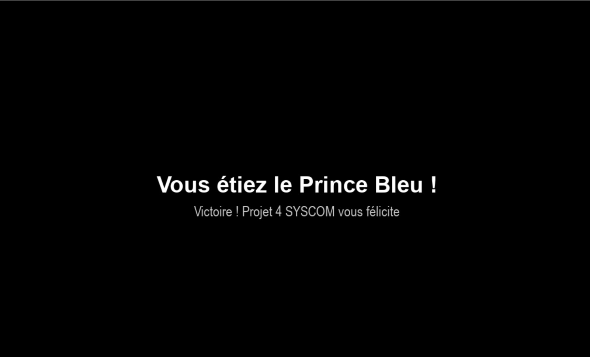

### Projet 4 SYSCOM – Version Simplifiée du jeu *Blue Prince*

Ce dépôt contient une implémentation simplifiée du jeu **Blue Prince** en Python, réalisée dans le cadre de notre cours de python module **Programmation Orientée Objet**.
Le projet met en pratique :

* l’architecture orientée objet en Python,
* la gestion d’un manoir généré dynamiquement,
* une interface graphique **pygame**,
* des interactions temps réel et des effets de salles.
---

## **Prérequis**

* Python **3.10+**
* `pip` installé

---

## **Installation**

Ouvrez un terminal et exécutez :

```bash
git clone https://github.com/CheikhOmarNdao/main.git
cd main
pip install -r requirements.txt
```

---

## **Lancer le jeu**

```bash
python main.py
```

---

## **Contrôles du jeu**

* **Z / Q / S / D** => déplacer le joueur
* **Flèches du clavier** => changer la direction d’ouverture
* **Espace** => ouvrir dans la direction choisie
* **1 / 2 / 3** => choisir une pièce dans le menu
* **R** => relancer la sélection (consomme un dé)
* **Échap** => quitter le jeu

---

## **Fonctionnalités principales**

* Génération dynamique du manoir (5 × 9)
* Pièces aléatoires selon rareté, couleur et contraintes
* Système d’inventaire complet : pas, gemmes, clés, dés, objets permanents
* Ouverture de portes selon direction et ressources
* Détection de **victoire** et **défaites**
* Effets uniques par salle + loots aléatoires
* Effets visuels :
   extinction progressive du manoir
   chute du joueur
   texte final en fondu
   écrans de victoire et défaite animés

---

## **Structure du projet**

```
main.py            > boucle principale du jeu + gestion des fins
manoir.py          > logique du manoir, grille, portes, déplacement, verrous
inventaire.py     > ressources du joueur et objets permanents
controle.py      > gestion des touches et actions du joueur
effets.py       > effets des salles + effets d’entrée + loots
tirages.py        > tirage de 3 pièces selon probabilités
affich_graph.py   >  affichage pygame (sprites, HUD, menu de choix)
catalogue.py       > liste complète des pièces et paramètres
```

---

## **Captures d’écran**
## Captures d’écran

Voici quelques images illustrant le jeu :

  
  
  
  


---

##  **Tests simples à effectuer**

* Générer plusieurs ouvertures de portes
* Vérifier les ressources consommées
* Tester les effets de salles (Gymnasium, Patio, Security…)
* Vérifier les fins :

  * atteindre l’Antechamber > **victoire**
  * 0 pas >**défaite**
  * aucun coup possible > **défaite**

---

## **Auteurs**

Projet réalisé dans le cadre de POO – Promo 2025 Groupe 4 SYSCOM.

---

## 📄 Licence

Projet académique – usage pédagogique uniquement.

---

